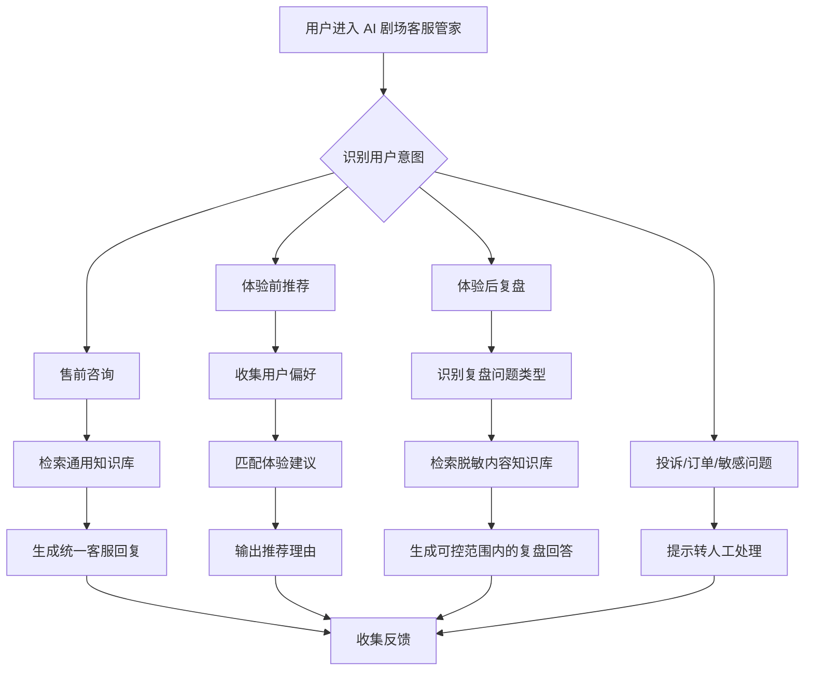

# AI 剧场客服管家

## 项目简介

AI 剧场客服管家是一个面向线下剧场/沉浸式体验类项目的 AI 客服产品方案。项目目标是将用户在体验前、体验中和体验后的高频问题整理成一个连续的 AI 服务入口，减少重复人工答疑，同时为后续用户运营和内容优化沉淀反馈。

本仓库展示的是脱敏后的产品设计与方法记录，不包含任何真实公司、真实剧场、真实角色、剧情文本或内部业务数据。

## 为什么做这个项目

线下剧场和沉浸式体验项目的用户问题通常分散在多个阶段：

- 购票前：用户会咨询项目介绍、适合人群、预约方式、注意事项等基础信息。
- 购票后体验前：用户可能需要根据偏好选择更适合自己的体验路线、角色或参与方式。
- 体验后：用户会继续追问剧情、人物关系、隐藏线索、与NPC对话陪伴等内容。
- 运营侧：客服和运营人员需要反复回答相似问题，但这些问答很难沉淀为结构化反馈。

因此，这个项目尝试把“客服答疑、体验前推荐、体验后复盘”整合成一个 AI 客服管家，用产品流程和 AI 工作流来承接这些重复但高价值的问题。

## 目标用户

- 对剧场/线下体验项目感兴趣、需要了解基础信息的潜在用户
- 已购票或已预约、需要体验前建议的用户
- 体验结束后，希望回顾内容、追问线索或整理体验记忆的用户
- 需要降低重复答疑成本、沉淀用户反馈的运营团队

## 核心场景

### 1. 售前咨询

用户提出项目介绍、时间安排、适合人群、注意事项等问题时，AI 客服管家优先从脱敏知识库中检索信息，并用统一口径回答。

### 2. 购票后体验前推荐

验证用户的已购票状态后，AI 客服管家根据用户对相关题目做出的选项，给出适合的体验线路与角色建议。公开展示版本只保留推荐逻辑，不包含真实角色或真实剧情。

### 3. 体验后复盘与情感陪伴

用户体验结束后，可以围绕内容线索、人物关系或体验感受继续追问，也可以与NPC数字人谈心交流，互相陪伴。AI 客服管家负责提供非敏感、非剧透或可控剧透范围内的回答。

### 4. 人工接管

当问题涉及订单、退款、投诉、隐私、敏感内容或 AI 无法确定的信息时，系统应引导用户转人工处理，而不是强行回答。

## 产品流程

## AI 能力使用方式

这个项目主要涉及以下 AI 产品能力：

- 意图识别：判断用户问题属于咨询、推荐、复盘还是人工处理。
- 知识库问答：用结构化知识库承接高频咨询和内容问答。
- 推荐逻辑：根据用户偏好生成适合的体验建议。
- 回复边界控制：对不确定、敏感或需要人工确认的问题进行兜底。
- Badcase 复盘：记录错误回答、无法回答和用户追问，用于后续优化。

## 当前展示范围

当前阶段先公开展示：

- 项目背景与业务问题
- 目标用户与核心场景
- 脱敏后的产品流程
- AI 工作流的整体设计思路
- 用户流程、原型截图、工作流架构
- 评测方法与 Badcase 复盘

## 相关文档

- [产品说明](docs/product-brief.md)
- [用户流程说明](docs/user-flow.md)
- [AI 工作流架构说明](docs/workflow-architecture.md)
- [评测与 Badcase 复盘](docs/CODEX_evaluation-and-badcase.md)
- [小红书发布草稿](docs/CODEX_xiaohongshu-post.md)

暂不公开：

- 真实 Dify 工作流导出文件
- 真实 Prompt 原文
- 真实知识库内容
- 真实剧场、角色、剧情、票务规则
- 真实用户对话和内部运营数据

## 脱敏说明

本项目来自真实业务场景的方法抽象，但公开版本已进行脱敏处理：

- 所有项目名称均改写为通用表达。
- 所有角色、剧情、票务、内部资料均不公开。
- 所有示例均使用虚构或通用线下体验服务场景。
- 如后续补充原型图、工作流截图或评测记录，会先去除可识别真实项目的信息。

## 后续计划

- 补充 Prompt 设计思路和回复边界
- 补充更完整的测试问题样例
- 补充更多 Badcase 的分类和优化记录
- 补充人工接管后的反馈闭环说明

