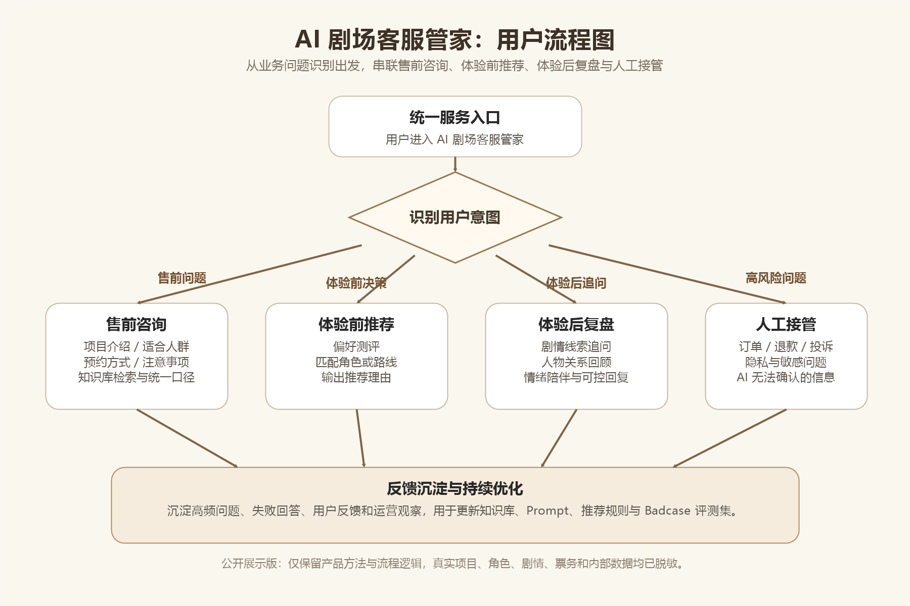

# 用户流程说明

本文件说明 AI 剧场客服管家的核心用户路径。公开版本已做脱敏处理，仅保留产品流程、交互逻辑和 AI 能力分工，不包含真实项目名称、真实角色、真实剧情文本、票务规则或内部业务数据。



## 流程目标

AI 剧场客服管家不是单一问答入口，而是围绕用户在体验前、体验中和体验后的连续服务需求，提供一个可以识别意图、承接问题、推荐体验路径、沉淀反馈的 AI 服务流程。

这个流程从业务痛点出发：

- 售前问题重复度高，人工客服需要反复回答项目介绍、适合人群、预约方式和注意事项。
- 用户在体验前缺少决策辅助，需要更轻量的角色或体验路线推荐。
- 用户体验后仍会追问剧情、人物关系、隐藏线索和个人体验感受。
- 运营侧需要把用户问题沉淀为可复用的知识、Badcase 和后续内容优化依据。

## 核心用户路径

### 1. 进入服务入口

用户进入 AI 剧场客服管家后，首先看到统一服务入口。系统不直接假设用户需求，而是根据用户点击入口或自然语言提问识别当前意图。

对应原型图：

- `splash.png`：进入页
- `feature-entry.png`：三类服务入口

### 2. 售前咨询

当用户咨询项目介绍、适合人群、预约方式、注意事项等基础问题时，系统优先进入售前咨询流程。

AI 侧主要工作：

- 判断问题是否属于通用客服问答。
- 从脱敏知识库或结构化资料中检索相关信息。
- 生成统一口径的答复。
- 遇到票务、退款、投诉、隐私等高风险问题时转人工处理。

### 3. 体验前角色推荐

当用户已进入体验前决策阶段，系统通过简短测评收集用户偏好，再给出推荐结果。

对应原型图：

- `role-quiz.png`：偏好测评
- `recommendation-result.png`：推荐结果

AI 侧主要工作：

- 将用户选项转化为偏好标签。
- 根据标签匹配适合的体验角色或路线。
- 输出推荐理由，而不是只给出结论。
- 避免泄露真实剧情、真实角色关系或内部规则。

### 4. 体验后复盘与对话

用户完成线下体验后，可以进入体验后复盘或 NPC 对话场景，继续追问人物关系、剧情线索、隐藏任务和体验感受。

对应原型图：

- `post-experience-chat-list.png`：体验后可对话角色列表
- `post-experience-chat-demo.png`：对话示例

AI 侧主要工作：

- 识别用户问题属于剧情复盘、情绪陪伴、线索追问还是服务问题。
- 在可公开、可控边界内生成回复。
- 对敏感、未确认或涉及真实运营的信息进行兜底。
- 将用户高频问题和失败回答沉淀为后续优化材料。

### 5. 人工接管与反馈沉淀

当系统判断问题超出 AI 可回答范围时，应主动提示转人工。所有流程结束后，可沉淀用户反馈、问题类型和 Badcase，用于后续优化知识库、提示词和服务规则。

## Mermaid 源文件

流程图源文件见：

```text
../assets/user-flow.mmd
```

后续如果要调整流程，建议先修改 Mermaid 源文件，再重新导出图片。
