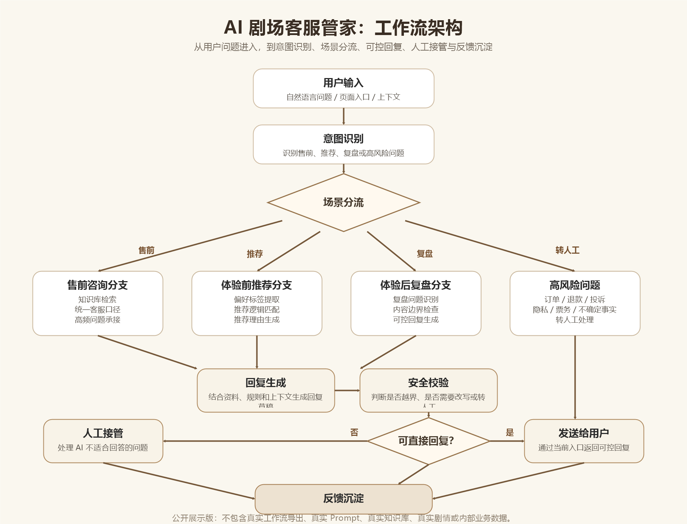

# AI 工作流架构说明

本文件说明 AI 剧场客服管家的脱敏版工作流架构。它不包含真实 Dify 工作流导出文件、真实 Prompt、真实知识库内容、真实项目名、真实角色名或真实剧情文本，只展示从业务问题到 AI 处理方案的产品设计思路。



## 设计目标

AI 剧场客服管家的核心目标不是做一个泛聊天机器人，而是承接线下剧场体验中反复出现、但又分散在不同阶段的服务问题。

工作流围绕三类业务场景设计：

- 售前咨询：承接项目介绍、适合人群、预约方式、注意事项等高频问题。
- 体验前推荐：根据用户偏好，给出适合的角色、路线或参与建议。
- 体验后复盘：围绕剧情线索、人物关系、体验感受和后续互动进行可控回复。

同时，工作流需要处理两个关键边界：

- 当 AI 无法确认事实或涉及敏感问题时，不强行回答。
- 当问题涉及订单、退款、投诉、隐私或真实运营规则时，转入人工接管。

## 整体工作流

用户输入会先进入意图识别节点，再根据场景分流到不同处理分支。每个分支都会结合相应的知识、规则或推荐逻辑生成回复草稿，之后再通过安全边界判断，决定直接回复、转人工，还是沉淀为后续优化材料。

简化流程如下：

```text
用户输入
  -> 意图识别
  -> 场景分流
  -> 知识库 / 推荐逻辑 / 复盘规则
  -> 回复生成
  -> 安全校验
  -> 用户回复 / 人工接管 / 反馈沉淀
```

## 节点说明

| 节点 | 作用 | 输入 | 输出 |
| --- | --- | --- | --- |
| 用户输入 | 接收用户自然语言问题或页面行为 | 用户问题、入口来源、上下文 | 原始请求 |
| 意图识别 | 判断用户当前需求类型 | 原始请求 | 售前咨询、体验前推荐、体验后复盘、人工接管 |
| 场景分流 | 将请求送入对应业务分支 | 意图分类结果 | 指定处理路径 |
| 知识库检索 | 查找可公开、可复用的客服资料 | 用户问题、场景标签 | 参考资料 |
| 推荐逻辑 | 根据用户偏好匹配体验建议 | 测评选项、偏好标签 | 推荐角色、路线或参与方式 |
| 复盘规则 | 控制体验后内容回答范围 | 复盘问题、内容边界 | 可回答范围和禁答边界 |
| 回复生成 | 组织面向用户的自然语言回答 | 问题、资料、规则、上下文 | 回复草稿 |
| 安全校验 | 判断回复是否越界或需要人工确认 | 回复草稿、风险规则 | 可发送、改写、转人工 |
| 人工接管 | 处理 AI 不适合回答的问题 | 高风险问题、用户诉求 | 人工服务入口 |
| 反馈沉淀 | 记录高频问题、失败回答和用户反馈 | 用户问题、处理结果 | 知识库、Prompt、Badcase 优化素材 |

## 业务分支

### 售前咨询分支

适用于用户想了解基础信息的场景，例如项目介绍、适合人群、预约方式、注意事项等。

处理逻辑：

1. 判断问题是否属于通用客服咨询。
2. 检索脱敏知识库或结构化资料。
3. 用统一客服口径生成回答。
4. 如果问题涉及价格、档期、订单、退款或投诉，转人工处理。

这个分支的价值在于减少重复人工答疑，同时保持对外答复口径稳定。

### 体验前推荐分支

适用于用户已经产生参与意愿，但不确定自己适合哪种体验路线或角色的场景。

处理逻辑：

1. 通过测评题收集用户偏好。
2. 将选项转化为偏好标签。
3. 根据标签匹配推荐结果。
4. 输出推荐理由和下一步行动建议。

这个分支不只给结论，更重要的是解释推荐理由，让用户理解为什么这个角色或路线适合自己。

### 体验后复盘分支

适用于用户完成体验后，继续追问剧情线索、人物关系、隐藏信息或体验感受的场景。

处理逻辑：

1. 判断问题属于剧情复盘、线索追问、情绪陪伴还是服务问题。
2. 检查该问题是否在可回答边界内。
3. 生成可控范围内的复盘回复。
4. 如果涉及未公开内容、真实内部信息或不确定事实，进行兜底或转人工。

这个分支的价值在于延长体验后的互动周期，同时避免 AI 过度剧透或编造信息。

## 安全边界与人工接管

以下情况不建议由 AI 直接回答：

- 订单、退款、投诉、改期等需要人工确认的问题。
- 用户隐私、个人信息或支付相关问题。
- 真实价格、真实档期、真实票务规则。
- 未确认事实、内部运营策略或敏感业务信息。
- 未公开剧情、真实角色设定或可能造成误导的内容。
- AI 无法从知识库或规则中确认答案的问题。

对于这些问题，工作流应输出明确的转人工提示，而不是生成看似确定但无法验证的回答。

## 后续迭代方向

后续可以继续补充：

- 更完整的意图分类样本。
- 售前咨询、体验前推荐、体验后复盘的脱敏 Prompt 设计。
- Badcase 评测集，用于验证回复是否准确、克制、可控。
- 人工接管后的反馈闭环，让人工处理结果反哺知识库和规则。
- 推荐逻辑的权重设计，让推荐结果更稳定、更可解释。

## 公开展示范围

当前公开版本只展示工作流架构和产品方法，不公开真实工作流配置。后续如需展示 Dify、Coze 或其他低代码平台配置，也应先进行脱敏处理，仅保留节点结构、变量设计和方法说明。
