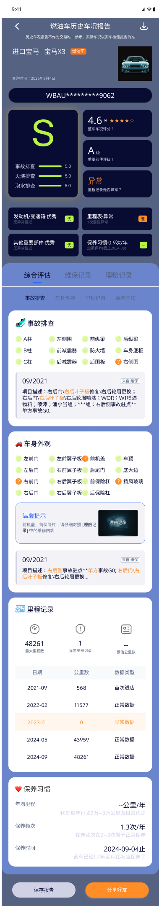
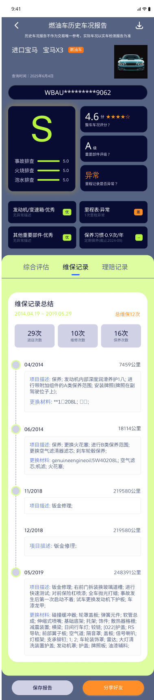
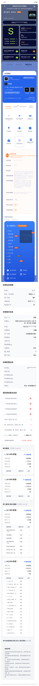

# 拍即合：用户流程与原型图

## 流程概览

拍即合的用户流程尽量保持短链路，先让用户输入 VIN，再逐步得到车况、估值、成本和出价参考。

```text
首页
  -> VIN 输入
  -> 车况综合评估
  -> 维保记录 / 理赔记录
  -> 三地输入
  -> 总成本估算
  -> 上传实际成本
```

## 关键页面

### 1. 首页


首页负责建立用户预期。用户能看到这个工具解决的是“法拍车出价前的估值与成本测算”，而不是泛泛的汽车查询工具。

页面重点：

- 明确入口：开始查询。
- 明确链路：VIN 输入、车况查询、比价估值、成本测算。
- 明确风险：估算仅供参考，不构成交易建议。

### 2. VIN 输入页


VIN 是整个流程的起点。这里的设计重点不是复杂，而是减少输入错误。

页面重点：

- 17 位 VIN 输入。
- 格式校验。
- “VIN 码是什么”的轻提示。
- 输入完成后进入车况查询。

### 3. 车况综合评估页



车况页把基础信息、风险标签和估值结果放在一起，让用户先判断这辆车是否值得继续看。

页面重点：

- 车辆基础信息。
- 里程、年款、过户次数等关键字段。
- 车况标签。
- 估值区间和参考说明。

### 4. 维保记录页



维保记录用于帮助用户理解车辆使用和保养情况。

页面重点：

- 按时间展示维修和保养记录。
- 突出里程、维修类型、记录描述。
- 辅助用户判断车辆是否存在异常使用痕迹。

### 5. 理赔记录页



理赔记录用于提示事故和赔付风险。

页面重点：

- 展示理赔次数和赔付金额。
- 区分轻微剐蹭、结构性风险等不同风险层级。
- 为后续出价保守系数提供参考。

### 6. 三地输入页


法拍车的成本不只在车辆本身。法院所在地、停车地、上牌地会影响拖车、差旅、提档和办理成本。

页面重点：

- 输入法院所在地。
- 输入车辆停车地。
- 输入上牌地。
- 进入总成本计算。

### 7. 总成本估算页


总成本页是决策页。它把车辆本身成本和拍得者额外成本分开，让用户看到“成交价之外还要花什么钱”。

页面重点：

- 建议最高出价。
- 预计总落地成本。
- 车辆本身成本。
- 拍得者额外成本。
- 风险提示和重新查询入口。

### 8. 事后复盘成本页


用户实际办理完后，可以上传真实成本。这个设计用于让后续估算有机会持续校准。

页面重点：

- 填写实际成交价。
- 填写过户、拖车、整备、差旅等实际成本。
- 将反馈沉淀为后续模型优化材料。

## 设计原则

这个 MVP 的页面设计不是为了把汽车信息展示得越多越好，而是按用户决策顺序组织信息：

1. 先确认车辆是谁。
2. 再看车况和估值。
3. 再算跨区域办理成本。
4. 最后得到出价边界。
5. 交易后把真实成本回流。

这样做的好处是，用户不会一上来被大量字段淹没，也不会只看成交价就冲动出价。
